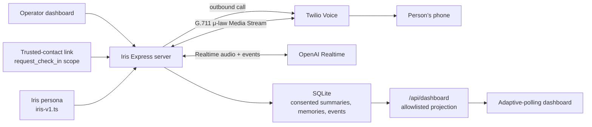

# Phone-first Bridge + Shield architecture

## Goal

Demonstrate safe, phone-first Bridge and Shield workflows: an operator or authorized trusted contact requests an outbound Iris check-in, Iris has a warm conversation with consented continuity, and Iris can offer a scam-safety pause followed by an explicitly approved, privacy-safe alert to a trusted contact.

## Security and privacy constraints

- `OPENAI_API_KEY` and Twilio credentials belong only in `server/.env`.
- Twilio connects to the public server over HTTPS/WSS; audio is relayed without application-side transcoding.
- Raw audio is never persisted. Transcript text is held only in memory through consent-gated summary extraction after the call, then discarded; it is never written to SQLite.
- Summary extraction runs only with active, revocable `summary_retention` consent. It uses structured output, stores no raw transcript, and persists only explicit durable facts, named people/context, unresolved topics, a recap, and an optional recall anchor. With separately active `care_summary_sharing` consent, the same extraction also produces a dashboard-only shared care recap with explicitly discussed health-related concerns and clearly attributed Iris guidance. It never adds a diagnosis, professional conclusion, or advice Iris did not say. Anchors never enter timeline payloads.
- Trusted contacts receive only their scoped dashboard projection. A family-requested call derives attribution from the grant, never a client-supplied name.
- Care-circle notes are shared dashboard content with two explicit paths: Home creates general person-level notes, while an expanded Calls thread creates a call-linked note and requires both `care_notes` and `view_summaries`. Home projects general notes plus notes from exactly the newest visible call; older call-linked notes remain thread-only. Notes carry operator or trusted-contact display-name/relationship snapshots so attribution survives contact deletion. An author may edit or soft-delete their own note: the shared admin identity owns operator notes, and a trusted contact owns only notes whose live `author_trusted_contact_id` matches their grant. Soft-deleted rows remain internal but are excluded from all projections and last-check-in calculations. Notes are never Timeline events, audit metadata, private Iris memory, Bridge context, or phone-session instructions. A viewer without `care_notes` receives neither notes nor the Notes-card last check-in date; existing links must be regenerated to gain the new scope.
- Call-originated Bridge and Shield actions persist the telephony call ID. Dispatcher lifecycle events, SMS delivery updates, and direct call events copy that ID into `events.call_id`, allowing an expanded Recent Call to show its own safe activity sequence. Enrollment and other non-call SMS remain unlinked. Historic unlinked actions are intentionally not backfilled.
- Timeline and call-thread payloads are allowlisted: no SMS body, phone number, provider ID, raw transcript, or audit metadata reaches the browser. **Calls** is limited to Recent Call threads; **Updates** contains the operator **Messages** recovery queue and **Recent activity** (unlinked person-level events). Call-linked events appear only in their Recent Call thread.
- SMS dispatch is approval-gated and uses a durable outbox. Uncertain sends require an explicit operator retry because retrying can duplicate a message.
- Every SMS is sent through the configured Twilio Messaging Service with one server-owned `Iris:` prefix and HELP/STOP footer. Bridge and Shield expose or send only to contacts whose current phone exactly matches an active trusted-contact SMS opt-in. The public opt-in form records consent separately from dashboard access.
- The signed `/api/messages/inbound` webhook stores no inbound message content. Twilio STOP/standard STOP variants append a revocation for every matching trusted-contact phone; HELP leaves local consent unchanged for the Messaging Service to answer, and START never restores Iris eligibility.
- Shield assessment is live-only at Iris: it sends only the Realtime-provided situation summary to `gpt-5.6-terra` with `store: false` (disabling OpenAI application-state / Logs retention for that request), then discards both input and assessment output locally. Prompts and outputs may still be retained under OpenAI’s default abuse-monitoring policy unless the organization has Zero Data Retention or Modified Abuse Monitoring. A pause recommendation persists only `shield.pause_offered` with an empty payload. After a pause, Iris is instructed to firmly advise stopping or limiting contact with the suspicious party (never helping draft a reply to them) and to promptly offer spoken approval for a short check-in alert to a listed trusted contact—naming the contact and purpose without reading the fixed SMS body aloud.
- A Shield alert uses one server-owned fixed SMS template and the same approval-gated outbox. `shield.alert_sent` is created only after Twilio accepts the send and projects only the trusted contact’s display name. Scenario text, red flags, assessment output, SMS body, phone number, and provider ID never enter the dashboard.
- Persona text is versioned in source so its changes are reviewable.

## Call completion

Outbound calls enable Twilio Answering Machine Detection (`MachineDetection=Enable`). Carrier connect alone is not treated as a human pickup: Iris records `call.answered` and opens the Media Stream only when AMD reports a human (or unknown/absent AnsweredBy). Voicemail/fax yields `call.no_answer`, an immediate hangup with a failed call (no summary), and no Realtime session. Busy and native Twilio `no-answer` statuses use the same `call.no_answer` timeline event.

`end_call` is available after a clear natural goodbye or an explicit request to end. After Iris asks for confirmation, a short yes (including “Yes, Iris”) or another natural goodbye (including “Goodbye, Iris”) counts as confirmation. Once Iris returns the tool result, the session binds the next `response.created` event, waits for that response’s OpenAI audio/done completion, then waits for a Twilio Media Stream mark acknowledging farewell playback before closing through the ordinary `CallSession` → call-manager finalization path. `IRIS_FAREWELL_CLOSE_TIMEOUT_MS` defaults to 8,000 ms and may be set to a whole value from 1,000 to 30,000 ms; it is a safety bound for that farewell only, never an idle-call timeout.

An ordinary handset hangup remains a fully supported completion path. Both paths clear the live session transcript into the same consent-gated summary lifecycle; transcript text is discarded after extraction and is never persisted.

## Deliberate deferrals

- Translator is not yet a vertical slice.
- There is no automatic retry for uncertain SMS dispatches.
- Call recording, raw transcript storage, and analytics persistence are intentionally out of scope.
