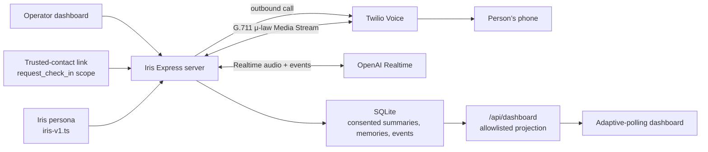

# Phone-first Bridge + Shield architecture

## Goal

Demonstrate safe, phone-first Bridge and Shield workflows: an operator or authorized trusted contact requests an outbound Iris check-in, Iris has a warm conversation with consented continuity, and Iris can offer a scam-safety pause followed by an explicitly approved, privacy-safe alert to a trusted contact.

## Security and privacy constraints

- `OPENAI_API_KEY` and Twilio credentials belong only in `server/.env`.
- Twilio connects to the public server over HTTPS/WSS; audio is relayed without application-side transcoding.
- Raw audio is never persisted. Transcript text is held only in memory through consent-gated summary extraction after the call, then discarded; it is never written to SQLite.
- Summary extraction runs only with active, revocable `summary_retention` consent. It uses structured output, stores no raw transcript, and persists only explicit durable facts, named people/context, unresolved topics, a recap, and an optional recall anchor. Dashboard call projections expose only the recap; anchors never enter timeline payloads.
- Trusted contacts receive only their scoped dashboard projection. A family-requested call derives attribution from the grant, never a client-supplied name.
- Timeline payloads are allowlisted: no SMS body, phone number, provider ID, raw transcript, or audit metadata reaches the browser.
- SMS dispatch is approval-gated and uses a durable outbox. Uncertain sends require an explicit operator retry because retrying can duplicate a message.
- Shield assessment is live-only: it sends only the Realtime-provided situation summary to `gpt-5.6-terra` with `store: false`, then discards both input and assessment output. A pause recommendation persists only `shield.pause_offered` with an empty payload.
- A Shield alert uses one server-owned fixed SMS template and the same approval-gated outbox. `shield.alert_sent` is created only after Twilio accepts the send and projects only the trusted contact’s display name. Scenario text, red flags, assessment output, SMS body, phone number, and provider ID never enter the dashboard.
- Persona text is versioned in source so its changes are reviewable.

## Call completion

`end_call` is available only for an unmistakable direct goodbye or explicit request to end. Once Iris returns the tool result, the session binds the next `response.created` event, waits for that response’s OpenAI audio/done completion, then waits for a Twilio Media Stream mark acknowledging farewell playback before closing through the ordinary `CallSession` → call-manager finalization path. `IRIS_FAREWELL_CLOSE_TIMEOUT_MS` defaults to 8,000 ms and may be set to a whole value from 1,000 to 30,000 ms; it is a safety bound for that farewell only, never an idle-call timeout.

An ordinary handset hangup remains a fully supported completion path. Both paths clear the live session transcript into the same consent-gated summary lifecycle; transcript text is discarded after extraction and is never persisted.

## Deliberate deferrals

- Browser WebRTC remains as a separate persona experiment, not the demo transport.
- Translator is not yet a vertical slice.
- There is no automatic retry for uncertain SMS dispatches.
- Call recording, raw transcript storage, and analytics persistence are intentionally out of scope.
