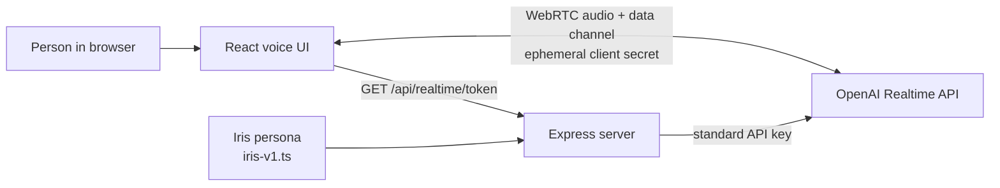

# Voice prototype architecture

## Goal

Validate Iris’s conversational warmth in a browser before coupling the experience to Twilio or any phone workflow.

## Security and privacy constraints

- `OPENAI_API_KEY` belongs only in `server/.env`.
- The browser receives a short-lived client secret only.
- A trusted backend supplies a stable, privacy-preserving safety identifier when creating each client secret.
- Audio is processed for the live interaction and not written to disk.
- Persona text is versioned in source so its changes are reviewable.

## Deliberate deferrals

- Twilio and phone calls
- SQLite and long-term memory
- Family dashboard, authentication, and sharing permissions
- Call recording, transcripts, and analytics persistence
- Bridge, Shield, and Translator workflows
